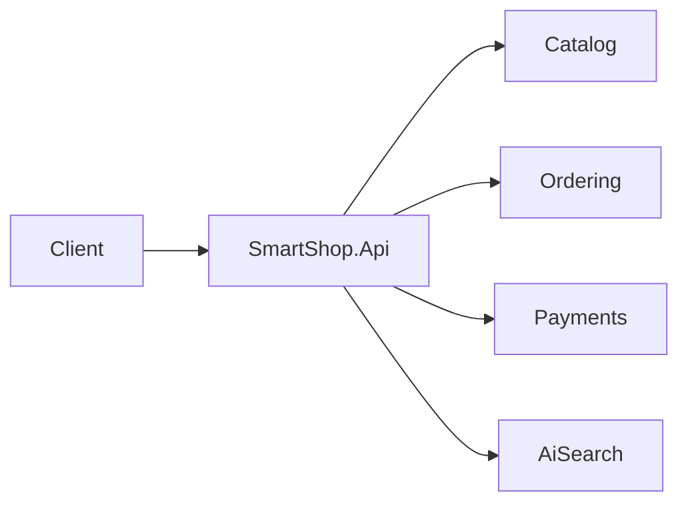
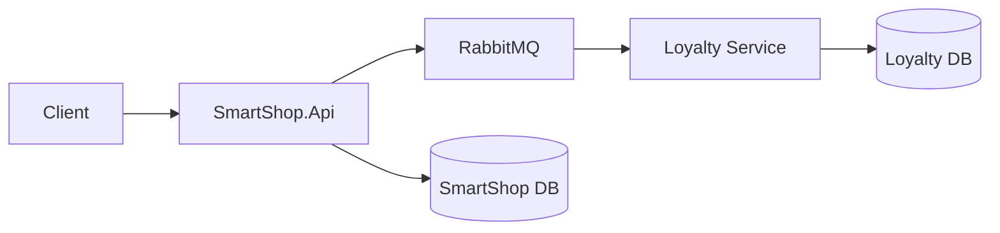
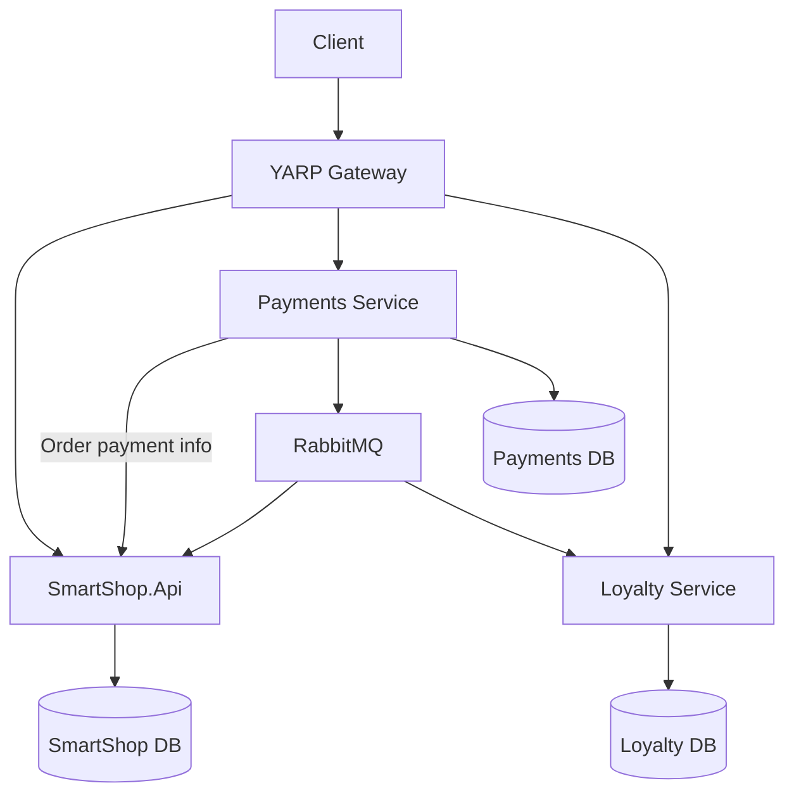

# معماری هدف کارگاه Microservices

## نقطه شروع

در شروع کارگاه، SmartShop یک Modular Monolith است. Catalog، Ordering، Payments و AiSearch در یک Process اجرا می‌شوند و ماژول‌های SQL از Schemaهای جدا در یک دیتابیس مشترک استفاده می‌کنند.

## پس از ایجاد Loyalty

Loyalty از ابتدا یک سرویس مستقل است. Payment موفق یک Integration Event منتشر می‌کند و Loyalty با تأخیر کوتاه امتیاز را اعمال می‌کند.

## معماری نهایی کارگاه

در مرحله نهایی، Payments از Modular Monolith استخراج شده است. Gateway مسیرها را بدون تغییر Client به مقصد درست هدایت می‌کند.

## مالکیت اجرا و داده

| جزء | مسئولیت | داده تحت مالکیت |
|---|---|---|
| SmartShop.Api | Catalog، Ordering و AiSearch | Catalog و Ordering Schemaها |
| Payments Service | ثبت و مشاهده پرداخت، Outbox | Payments Database و Outbox |
| Loyalty Service | مانده و گردش امتیاز، Inbox | Loyalty Database |
| Gateway | Route و مرز عمومی | بدون داده کسب‌وکاری |
| RabbitMQ | انتقال Integration Event | داده موقت پیام |

## ارتباط هم‌زمان

Payment Service برای آغاز پرداخت باید بداند سفارش وجود دارد، قابل پرداخت است، متعلق به کدام مشتری است و مبلغ نهایی آن چقدر است. این اطلاعات از API داخلی Ordering دریافت می‌شوند.

ویژگی‌های این ارتباط:

- Request/Response
- Timeout محدود
- Retry فقط برای خطاهای گذرای امن
- Circuit Breaker
- عدم دسترسی مستقیم به Ordering Database

## ارتباط غیرهم‌زمان

پس از ثبت Payment، واقعیت `PaymentSucceededV1` منتشر می‌شود.

مصرف‌کنندگان:

- Ordering: تغییر وضعیت سفارش به Paid
- Loyalty: محاسبه و ثبت امتیاز

ویژگی‌های این ارتباط:

- At-least-once Delivery
- Eventual Consistency
- Outbox در تولیدکننده
- Idempotency در مصرف‌کنندگان
- قرارداد نسخه‌دار

## Service Discovery

در اجرای Local، نام سرویس‌های Docker Compose نقش DNS را دارد. Payment Service با یک نام منطقی به SmartShop.Api متصل می‌شود.

در بخش نظری، همین نیاز با گزینه‌های زیر مقایسه می‌شود:

- Configuration ثابت برای محیط ساده
- Registry مانند Consul
- Service Discovery داخلی Kubernetes
- Managed Service Discovery در Cloud

هدف کارگاه پیاده‌سازی چند Registry نیست؛ هدف فهمیدن مسئله و انتخاب ابزار متناسب با محیط است.

## مرز Production Readiness نسخه کارگاه

- Health Check برای Process، دیتابیس و Broker
- Correlation Identifier مشترک
- Structured Logging
- Timeout، Retry و Circuit Breaker برای HTTP داخلی
- Outbox و Idempotent Consumer
- Migration مستقل هر دیتابیس
- تست قواعد Domain و قراردادهای کلیدی
- Docker Compose قابل اجرا

مواردی مانند Kubernetes، Autoscaling، Secret Manager واقعی، Service Mesh و Multi-region خارج از محدوده پیاده‌سازی هستند و فقط در جای مناسب اشاره می‌شوند.

